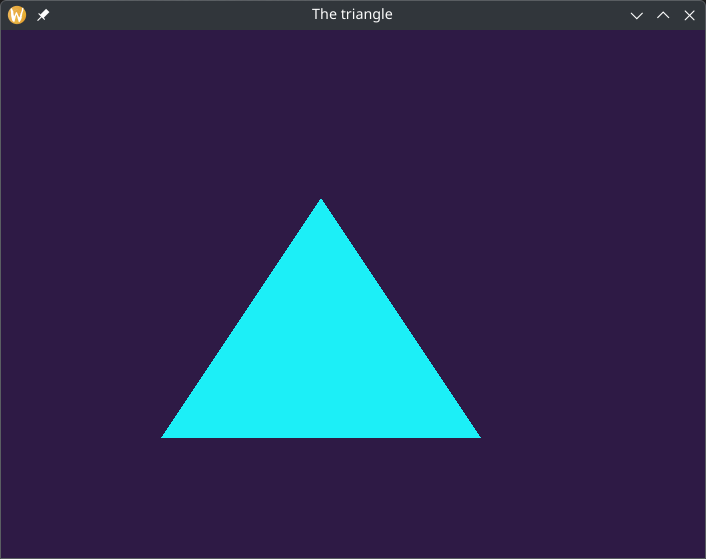

<!--
.. title: Learning OpenGL in 2025.
.. slug: learning-opengl-in-2025
.. date: 2025-06-12 19:34:36 UTC-04:00
.. tags: opengl,dev
.. category: graphics-programming
.. link: 
.. description: The start of my experience with OpenGL and game programming.
.. type: text
-->

## My history in a nutshell.
---
I'm a notorious project hopper.  While I've done small scale projects in a bunch of high level languages, I find myself unable to stick to just one.  Python seems to be the one I come back to most, but I've also played around with Java, C#, Lua, Rust, C, Javascript, Dart, and most importantly for this project, C++.

That being said, something about OpenGL was calling to me, but it seemed above my skill level.  My history consisted of web crawlers, API wrappers, and maaaaybe a discord bot or two as a teenager.  Could I really do something this complex?

## Starting the project
---
I set my sights on OpenGL and took a moment to breathe.  With little to no experience in serious C++ coding, I felt a tightness in my chest even approaching the topic.

I made a couple decisions early on.  Mainly, I wanted to use CMake as my build system.  Beyond that, I wanted to use some external libraries to make my life just a little bit easier.  

### CMake and dependencies
---

Here's my CMakeLists.txt:
```CMake
cmake_minimum_required(VERSION 4.0)
project(opengl-playground)
set(LUA_VERSION "lua-5.4.7")
find_package(Lua REQUIRED)

include_directories(include/glad ${LUA_LIBRARIES})
add_executable(opengl-playground
    src/main.cpp
    src/glad/glad.c)
target_link_libraries(opengl-playground glfw ${LUA_LIBRARIES})


```

As you can see, I included [GLFW](https://www.glfw.org/), glad, and Lua into this project.  GLFW is an open source library that essentially gives us an API to interact with OpenGL easier.  Glad manages function pointers for us, and Lua is Lua.  For now, that can be ignored.  It will come into play later. 

## Finding the resources to learn OpenGL
---
A surprisngly easy task.  A quick google search brought me to [Learn OpenGL](https://learnopengl.com/).  On their site they provide a free PDF to learn openGL.  Openening the book, one main thing caught my eye


I nearly squealed when I found this!  Sure, that's not until much later in the book, but if it's willing to take me as far as an example Breakout clone?  I'm interested.

I rode that high for a minute, prepping my project a bit more.  I setup my project directory like so:

```
-include
    -glad
        glad.h
        khrplatform.h
-src
    -glad
        -glad.c
    -main.cpp
```

## Understanding OpenGL.

At this point, I got to reading.  Over the course of the next few days, I read through to `Chapter 6 - Shaders` multiple times, still not fully understanding the concepts the book was trying to teach me.  My understanding of how the rendering pipeline worked was as follows;

* Step 1 - OpenGL takes in a vertex shader that takes in a single vertex.  The idea is that we can do basic processing on the vertex attributes here, allowing us to modify color output and the like.
* Step 2: We then take all the input from the vertex shader and form the primitive shapes
* Step 3 - Those primitives get a geometry shader applies to them, and from this we can emit new verticies to form new primitives.
* Step 4 - The geometry shader is then rastertized, meaning that the primitives we generated earlier are mapped to their screen position, resulting in fragments.  It's at this point clipping happens.
    * A fragment is the data for a single pixel.
    * Clipping is just removing any unseen fragments from rendering.
* Step 5 - The fragment shader then calculates the final color of the pixel. 
* Step 6 - Alpha test and blending.

I started to understand a little bit, and Youtube videos helped me cover a little bit more.  With just a little bit of hope, I opened up VSCode and set my sights to getting a triangle on the screen.


## Writing the code
I wrote the code a few days ago, and while I *could* just drop all ~250 lines into a code block and call it a day, that doesn't sound too fun.  Instead, I want to show you my triangle!



He's a little off-center, and the colors might clash a bit, but I got a triangle rendering!

# Ending things off
I'm terrible at endings, so I figured I could try and hook you a bit for my next post.

I will try and explain my understanding of how to work with OpenGL in C++.  My goal, by the end of the post, is to have two triangles on screen.  I want one to fade between the RGB spectrum, though that might be a bit out of my reach.  The only way to find out is to get reading (~~and watching youtube videos, let's be honest~~) into Chapter 6.